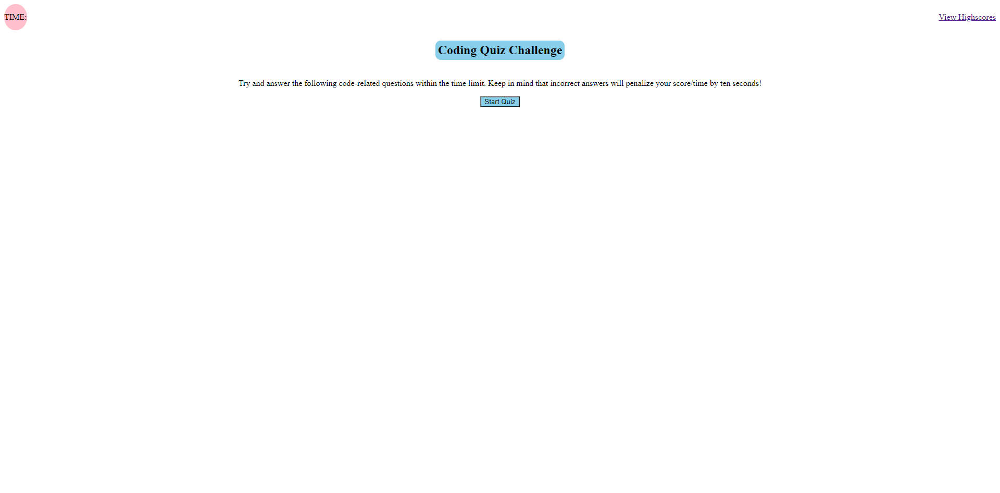

# code-quiz

## Description

Our week 3 homework assignment tasked us with creating a code quiz from scratch. The acceptance criteria was a follows: 
-WHEN I click the start button
-THEN a timer starts and I am presented with a question
-WHEN I answer a question
-THEN I am presented with another question
-WHEN I answer a question incorrectly
-THEN time is subtracted from the clock
-WHEN all questions are answered or the timer reaches 0
-THEN the game is over
-WHEN the game is over
-THEN I can save my initials and set my score on the board

## What I did

I started with a basic html layout with 3 main containers and with the first container having 2 sections. Inside these containers were elements that had ID'd assigned to them so they could be accessed in JS easily. Using this html layout I worked through JS to create a large number of variables to be used in JS and relayed to HTML. 

I have 4 click events for each of the answers to my questions so when they are clicked it will call a function that iterates to the next question. I also have an array of objects with each object being a question and four answers. 

I then started with an inital function which is what is called to display the webpage when a user first loads it. Inside this function there's a click event which calls the countdown function and quiz function. The countdown function starts the timer and the quiz function displays the first quesiton/answer. I have a determine answer function that will assess whether a person guessed the right answer or not and displays wrong/correct. I created another function for quizDelay so that a user can see the message wrong/correct after they clicked an answer and it delays the advancement of the quiz by half a second.

After a quiz is finished or the timer runs out, doneQuiz function is called which gets rid of the question and displays a new message and an input form to put initials for highscore with a submit button. When submit is entered/clicked it called for functions storehighscores (which sets the values from the input and score which are in and object into local storage and stringifies them) and display highscores (which calls for render highscores function). The function renderHighscores contains a for loop that will add each highscore to an ordered list a dispays them while also calling the another function. This function created 2 buttons, one sends the user back to the starting page while the other clears local storage and the list of highscores on screen. The last function I have in JS is for viewHighscores which displays the highscores when clicked. 

I styled all these elements either in JS through setAtrribute or in css.

## Finished Product

Here is a screenshot and link to the finished code quiz:
[Link to webpage](https://phalenh.github.io/code-quiz/main/index.html)

